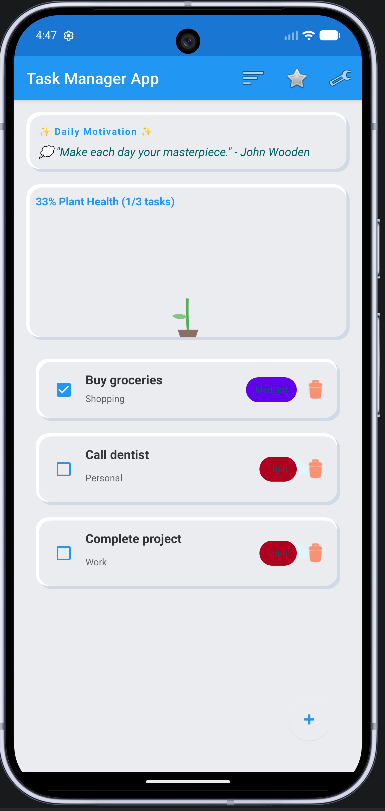
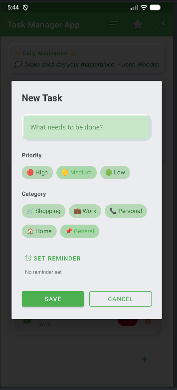
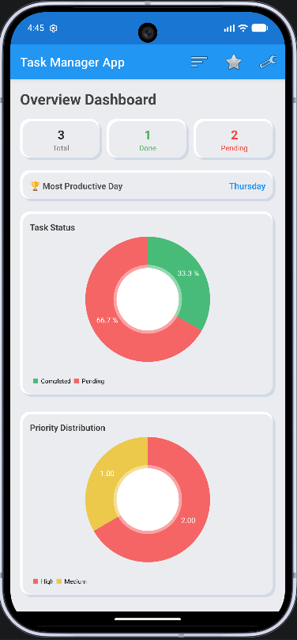
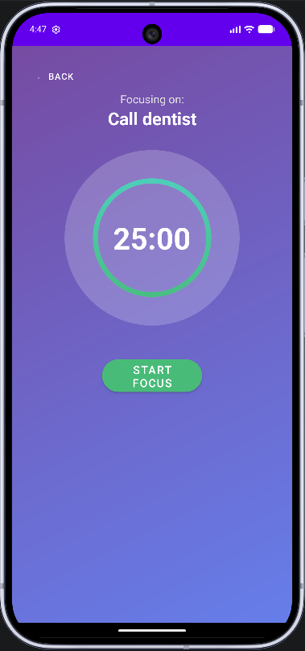
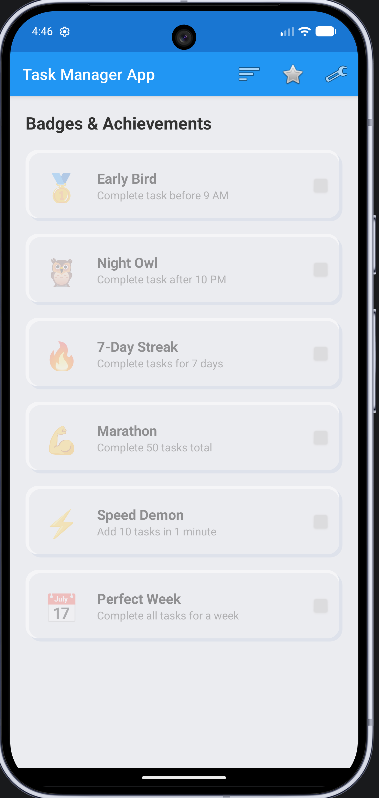
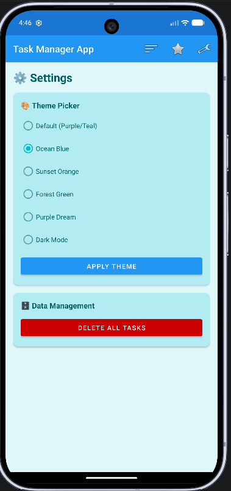

 # 📱 Task Manager & Productivity App
https://github.com/alihaider01-cs/android-mobile-application/tree/main
A feature-rich Android task management and productivity application developed using **Kotlin and Android Studio**. The application helps users organize daily tasks, monitor productivity, maintain focus through a dedicated timer, and track achievements and statistics.

This project was developed as an academic Android application project and provided hands-on experience with Android development, UI design, application architecture, data persistence, background services, notifications, and user-focused functionality.

---

## ✨ Features

### 📝 Task Management

- Create and manage daily tasks
- Add new tasks with relevant information
- Set task names and priorities
- Organize tasks by categories
- Mark tasks as completed
- Edit and delete existing tasks
- Track task creation and completion information

### ⏱️ Focus Timer

- Dedicated focus/productivity timer
- Countdown functionality
- Start and pause focus sessions
- Foreground service for timer operation
- Notification support during focus sessions
- Helps users maintain focused working periods

### 📊 Productivity Dashboard

- View productivity statistics
- Monitor completed tasks
- Track task-related progress
- Visual representation of productivity data

### 🏆 Achievements

- Achievement system based on user activity
- Tracks productivity milestones
- Provides motivational feedback as users complete tasks and goals

### ⚙️ Settings

- Application settings and preferences
- Theme-related functionality
- Sound and notification-related controls
- User experience customization

### 🔔 Reminders & Notifications

- Task reminder functionality
- Notification support
- Scheduled task reminders

### 📱 Home Screen Widget

- Android home screen widget support
- Quick access to task-related information

---

# 📸 Application Screenshots

## 🏠 Home Screen



The home screen provides the main task management interface where users can view and manage their daily tasks.

---

## ➕ Add Task



The Add Task screen allows users to create new tasks and provide the required task information before adding them to their task list.

---

## 📊 Dashboard



The dashboard provides an overview of productivity and task-related statistics, helping users monitor their progress.

---

## ⏱️ Focus Timer



The focus timer helps users maintain concentration during dedicated productivity sessions.

---

## 🏆 Achievements



The achievements section tracks user progress and productivity milestones.

---

## ⚙️ Settings



The settings screen provides controls for customizing application behavior and preferences.

---

# 🛠️ Technologies Used

## Programming Language

- **Kotlin**

## Development Environment

- **Android Studio**
- **Gradle**
- **Kotlin DSL**

## Android Technologies

- Android SDK
- AndroidX
- View Binding
- Fragments
- Navigation Component
- ViewModel
- LiveData
- Coroutines
- Foreground Services
- Broadcast Receivers
- Android Notifications
- App Widgets

## Libraries

- AndroidX Core KTX
- AndroidX AppCompat
- Material Components
- ConstraintLayout
- Navigation Component
- Lifecycle ViewModel
- Lifecycle LiveData
- Gson
- Lottie
- Konfetti
- MPAndroidChart
- AndroidX Splash Screen

---

# 🏗️ Application Architecture

The application uses Android architecture components to separate the user interface from application logic.

```text
UI / Fragments
      ↓
ViewModel
      ↓
Application Logic
      ↓
Local Data Persistence

---

# 💾 Data Management

The application stores task-related information locally.

Task information includes:

- Task ID
- Task name
- Priority
- Category
- Completion status
- Creation timestamp
- Completion timestamp
- Reminder time

The project uses **SharedPreferences together with Gson** for local data persistence and serialization.

---

# 🔔 Background Functionality

The application demonstrates several Android background capabilities.

## Focus Service

A foreground service is used to support the focus timer and maintain timer functionality while the application is not actively being displayed.

## Reminder Receiver

Broadcast receiver functionality is used to handle scheduled task reminders and notification events.

## Home Screen Widget

An Android App Widget provides quick access to task-related information directly from the device home screen.

---

 # 🧩 Main Application Components

The project contains several major components:

- **Main Activity**
- **Home / Task Management**
- **Add Task**
- **Dashboard / Statistics**
- **Achievements**
- **Settings**
- **Focus Timer**
- **Focus Service**
- **Task ViewModel**
- **Reminder Receiver**
- **Task Widget Provider**
- **Splash Screen**
- **Theme Helper**
- **Sound Helper**

---

# 🎯 Project Objectives

The main objectives of this project were to:

- Apply Android development concepts in a practical application
- Develop a functional task management system
- Practice Kotlin programming
- Understand Android application architecture
- Implement local data persistence
- Work with ViewModel and LiveData
- Implement background services
- Handle notifications and reminders
- Design user-friendly Android interfaces
- Develop a productivity-focused mobile application

---

# 📚 What I Learned

Through this project, I gained practical experience in:

- **Kotlin programming**
- **Android application development**
- **Android Studio and Gradle**
- **UI and layout development**
- **Fragment-based application design**
- **View Binding**
- **ViewModel and LiveData**
- **Navigation Component**
- **Local data persistence**
- **JSON serialization with Gson**
- **Coroutines and background operations**
- **Foreground services**
- **Broadcast receivers**
- **Notifications**
- **Android widgets**
- **Application debugging**
- **Problem solving**
- **Software development**

This project improved my understanding of how different Android components work together to create a complete mobile application.

---

# 🚀 How to Run the Project

## Requirements

Before running the project, make sure you have:

- Android Studio
- Android SDK
- Compatible JDK
- Android device or emulator

## Steps

1. Clone this repository.
2. Open the project in Android Studio.
3. Allow Gradle to synchronize and download the required dependencies.
4. Connect an Android device or start an Android emulator.
5. Build and run the application.

---

# 📂 Project Structure

The main project structure includes:

- `app/` — Main Android application module
- `app/src/main/java/` — Kotlin source code
- `app/src/main/res/` — Application resources
- `app/src/main/res/layout/` — Application layouts
- `app/src/main/res/drawable/` — Drawable resources
- `app/src/main/res/navigation/` — Navigation configuration
- `app/src/main/res/values/` — Strings, themes, and other values
- `screenshots/` — Application screenshots
- `AndroidManifest.xml` — Android application configuration
- `build.gradle.kts` — Gradle build configuration
- `settings.gradle.kts` — Project settings
- `README.md` — Project documentation

---

# 🔧 Key Concepts Demonstrated

This project demonstrates practical implementation of important Computer Science and software development concepts.

## Object-Oriented Programming

Kotlin classes and structured components were used to organize application functionality and maintain a modular codebase.

## Data Management

Local storage and serialization were implemented to maintain persistent task information.

## Software Architecture

Android architecture components were used to separate the user interface from application logic and data management.

## Event-Driven Programming

The application handles user interactions, notifications, reminders, timer events, and other system events.

## Concurrency & Background Processing

Coroutines and Android background components were used to perform operations without blocking the main UI thread.

## User Interface Design

Multiple screens were designed with a focus on usability, simplicity, and productivity.

---

# 🔮 Future Improvements

Possible future improvements include:

- Cloud synchronization
- User authentication
- Firebase integration
- Cross-device task synchronization
- Advanced productivity analytics
- Recurring tasks
- More customizable reminders
- Improved accessibility
- Additional productivity statistics
- Automated testing
- Enhanced database architecture

---

# 🎓 Academic Project

This application was developed as part of my **Computer Science academic coursework** to gain practical experience in Android application development and software engineering.

The project allowed me to transform concepts learned in class into a functional mobile application while developing my programming, problem-solving, debugging, and software development skills.

---

# 👨‍💻 Developer

**Ali Haider**

Computer Science Student

## Areas of Interest

- Software Development
- Artificial Intelligence & Machine Learning
- Data Science
- Databases
- Mobile Application Development
- Computer Science Research

---

# 📌 Project Status

**Completed Academic Project**

The application demonstrates:

- Task management
- Task creation
- Productivity tracking
- Focus sessions
- Achievements
- Reminders
- Notifications
- Android application components

---

⭐ If you find this project interesting, feel free to explore the repository and its implementation.
